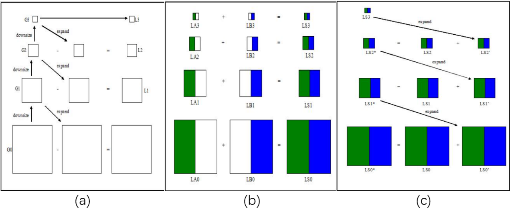
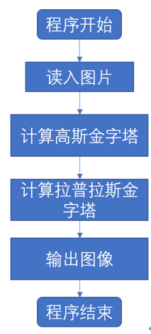
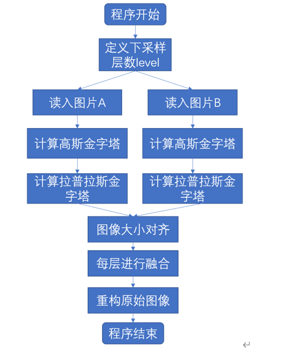
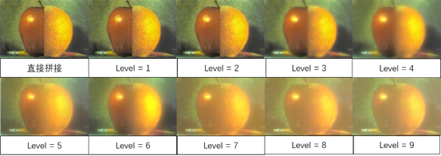
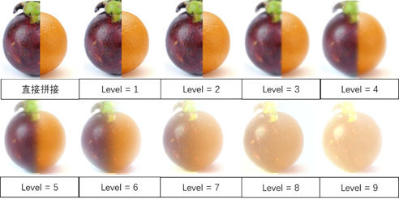

# 实验一：图像融合

## 实验原理

### 1 金字塔图像融合

拉普拉斯方法是一种利用高斯下采样的图像融合算法，该算法旨在不同波段进行图像融合，在保持被融合图像显著性特征时，仍能得到很好的图像融合效果。该算法包含两个金字塔过程，即：高斯金字塔和拉普拉斯金字塔。

高斯金字塔用于图像的下采样。首先用高斯卷积核对原图像进行处理，之后删除图像偶数行和偶数列的像素。这样操作一次一个$M*N$的图像就变成了一个$\frac{M}{2}*\frac{N}{2}$的图像。所以这幅图像的面积就变为原来图像面积的四分之一。循环上述过程，我们就会得到一个分辨率不断下降的图像金字塔。

拉普拉斯金字塔用于重建图像，能对图像进行最大程度的还原。首先对原图扩展为原来4倍，新增的行和列以0填充。之后使用下采样中的卷积核（乘四倍）与原图像进行卷积获得结果。再结合先前高斯金字塔计算结果，其公式如下：
$$
L_i=G_i-PyrUp(G_i+1)
$$
上图很好地展示了整个金字塔图像融合算法的过程（以3层为例）。具体的，首先对原图像进行高斯金字塔卷积并保存待用，之后将高层的高斯金字塔扩展为上一层大小，并相减得到的残差值作为拉普拉斯金字塔的值。如此迭代，最终将所有拉普拉斯图像融合得到最终融合图像。

## 实验步骤

### 1 高斯金字塔和拉普拉斯金字塔

### 2 图像融合

## 3 实验结果

- #### 比较不同层数融合

- #### 比较撞色融合结果

### 4 参考资料

[imagemosaic (wisc.edu)](http://pages.cs.wisc.edu/~csverma/CS766_09/ImageMosaic/imagemosaic.html)

[(21条消息) python+opencv图像金字塔融合_益达888的博客-CSDN博客_python 金字塔融合](https://blog.csdn.net/qq_29023939/article/details/81101168?utm_medium=distribute.pc_relevant.none-task-blog-2~default~CTRLIST~default-1.no_search_link&depth_1-utm_source=distribute.pc_relevant.none-task-blog-2~default~CTRLIST~default-1.no_search_link)

[(21条消息) 图像金字塔实现图像融合（基于opencv-python）_橘露源的博客-CSDN博客_python实现图像融合](https://blog.csdn.net/weixin_41122036/article/details/103071247)

[使用拉普拉斯特征金字塔实现图像融合-python黑洞网 (pythonheidong.com)](https://www.pythonheidong.com/blog/article/541904/81efc0c94138df43fd9a/)

[4_8_图像金字塔 - OpenCV中文官方文档 (woshicver.com)](http://woshicver.com/FifthSection/4_8_图像金字塔/)

