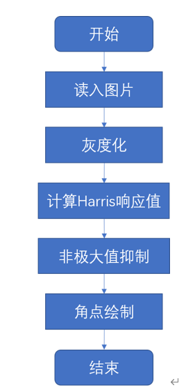
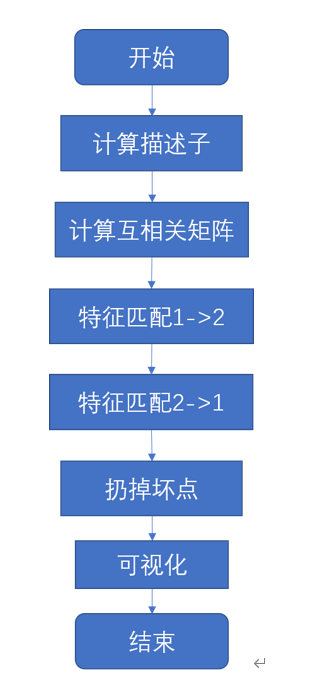
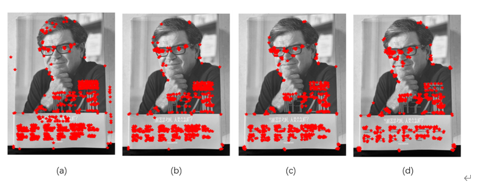
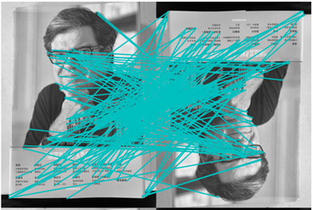

# 实验三：特征检测与描述

## 实验原理

### 1 Harris角点检测

Harris角点检测算法是一个极为简单的角点检测算法。该算法的主要思想是，如果像素周围显示存在多于一个方向的边，我们认为该点为兴趣点（角点）。

这里，将图像中点x上的对称半正定矩阵M定义为：
$$
M_I=\mathrm{\nabla I\nabla}I^T=
\left[
 \begin{matrix}
   I_x\\
   I_y \\
  \end{matrix} 
\right]
[Ix,Iy]=
\left[
 \begin{matrix}
   I_x^2 & I_xI_y\\
   I_xI_y & I_y^2 \\
  \end{matrix} 
\right]
$$
其中$\nabla I$为包含导数$I_x$和$I_y$的图像梯度。由于该定义，$M_I$ 的的秩为1，特征值为 $\lambda_1 = |\nabla I|^2$以及$\lambda_2=0$ 。因此，这对图像的每一个像素，我们可以计算出该矩阵。

选择权重矩阵W，我们可以得到卷积：
$$
{\bar{M}}_I=W\ast M_I
$$
该卷积的目的是得到$M_I$在图像周围像素的平均值。那么此时，计算出来的 ${\bar{M}}$矩阵即为Harris矩阵。

根据该区域$\nabla I$的值，Harris矩阵$\bar{M}$的特征值有以下三种情况：

1. 如果$\lambda_1$和$\lambda_2$都是很大的整数，那么该点为角点；
2. 如果$\lambda_1$很大，而$\lambda_1\rightarrow0$，则该区域内存在一个竖直边，反之存在水平边。
3. 如果$\lambda_1\rightarrow0,\lambda_2\rightarrow0$，那么该区域内为平坦区域。

在不需要计算特征值的情况下，引入指示函数：
$$
det({\bar{M}}_I)-\kappa\ trace({\bar{M}}_I)
$$

### 2 在图像间寻找对应点

在寻找了图像兴趣点的基础上，我们需要为每个点增加描述子信息，并给出一个比较这些描述子的方法进行匹配。所谓兴趣点描述子就是分配给兴趣点的一个向量，描述该点附近的图像的表观信息。

Harris角点的描述子通常是由周围图像像素块的灰度值，以及用于比较归一化互相关矩阵构成。通常，两个相同大小的像素块$I_1(x)$和$I_2(x)$的相关矩阵定义为：
$$
c(I_1,I_2)=\sum_{x}{f(I_1\left(x\right),I_2\left(x\right))}
$$
这里使用归一化的相关矩阵，其定义如下：
$$
ncc(I_1,I_2)=\frac{1}{n-1}\sum_{x}{f(\frac{{(I}_1\left(x\right)-\mu_1)}{\sigma_1},\frac{{(I}_2\left(x\right)-\mu_2)}{\sigma_2})}
$$

## 实验步骤

### 1 算法流程

### 2 特征匹配

## 实验结果

## 参考资料

Jan Erik Solem *Programming Computer Vision with Python* O’Reilly Media INC,2014