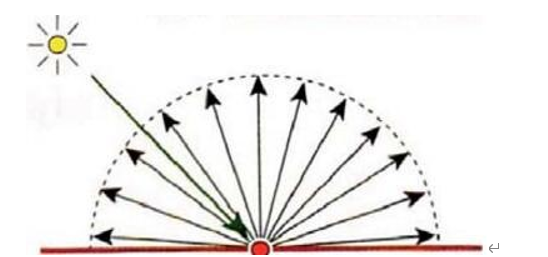
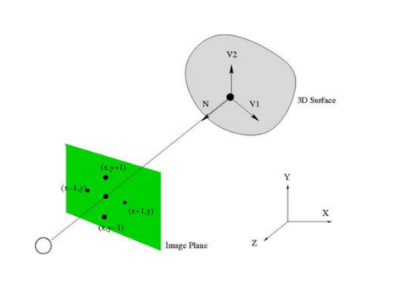
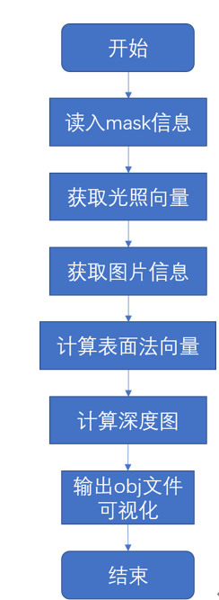
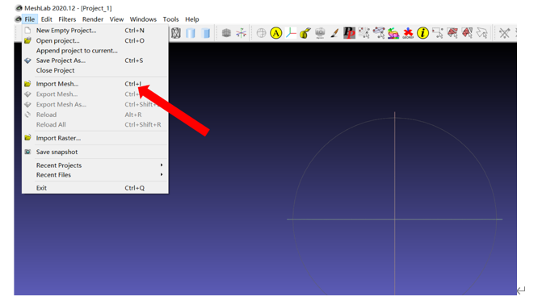
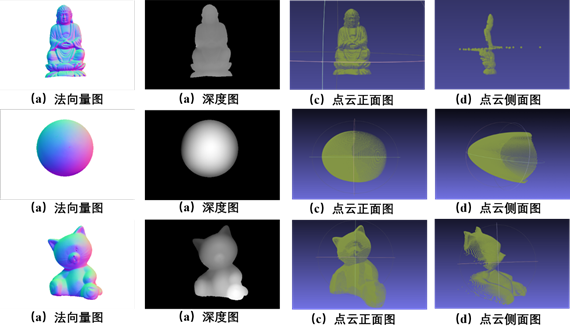
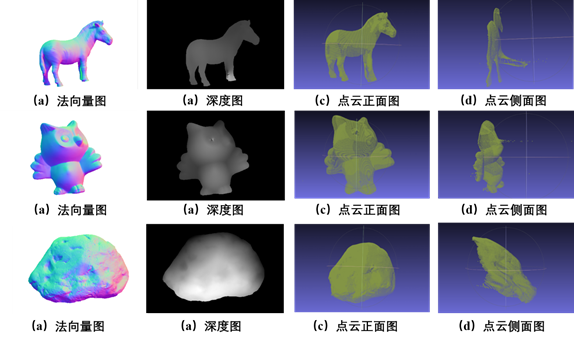

# 实验二：光度立体重构

## 参考资料

我当时网上找的参考资源，可以先行阅读以下材料后再进行代码编写：

[(21条消息) Halcon 光度立体法（photometric_stereo）详解_ZiLiangQin的博客-CSDN博客_photometric stereo](https://blog.csdn.net/qq_18620653/article/details/109074938)

[(21条消息) Photometric Stereo 光度立体三维重建（一）——介绍_SZU_Kwong的博客-CSDN博客_光度立体法三维重建](https://blog.csdn.net/SZU_Kwong/article/details/112724439)

[stereo (wisc.edu)](http://pages.cs.wisc.edu/~csverma/CS766_09/Stereo/stereo.html)

[CS5670 Project 4 -- Stereo (cornell.edu)](http://www.cs.cornell.edu/courses/cs5670/2019sp/projects/pa4/)

[https://doc.lagout.org/science/0_Computer Science/2_Algorithms/Computer and Machine Vision_ Theory%2C Algorithms%2C Practicalities %284th ed.%29 %5BDavies 2012-03-19%5D.pdf](https://doc.lagout.org/science/0_Computer Science/2_Algorithms/Computer and Machine Vision_ Theory%2C Algorithms%2C Practicalities (4th ed.) [Davies 2012-03-19].pdf)

[Computer and Machine Vision: Theory, Algorithms, Practicalities (lagout.org)](https://doc.lagout.org/science/0_Computer Science/2_Algorithms/Computer and Machine Vision_ Theory%2C Algorithms%2C Practicalities (4th ed.) [Davies 2012-03-19].pdf)

[xiumingzhang/photometric-stereo: A MATLAB Implementation of the Basic Photometric Stereo Algorithm (github.com)](https://github.com/xiumingzhang/photometric-stereo)

## 实验原理

### 1 朗伯反射模型

郎伯反射称作完全漫反射。这是一种理想情况，现实中不存在完全漫反射，但Lambertian可以用来近似的模拟一些粗糙表面的效果，比如纸张。

其特点如下：

1）入射方向与出射方向无关；

2）反射光的量和其与法向量夹角有关；

3）表面亮度不取决于观察角度。

这里，我们假定物体表面是符合郎伯反射条件的，并且每个图像由单一光源照射。那么，对于图像中每一个位置（x,y），其对应反射强度就为：
$$
I(x,y) = p(x,y)\vec{n}(x,y)^T\vec{s}
$$
其中，

  $p(x,y)$是物体表面上每一个点的反射率;

  $\vec{n}(x,y)$是光源与物体的3维相对位置向量（s包含光源的方向和强度）;

  $\vec{s}$表示了图像中每个点的法向量.

### 2 重构

- #### 从3张图片进行3维重构

这里，输入的图像是从同一位置的同一相机拍摄到的，但是是从不同光照条件下的。当我们对每个物体表面的深度感兴趣的时候，我们希望恢复物体的表面法向量$vec{n}(x,y)$，并由此得到物体的深度$z(x,y)$  。因为光照条件已经被给出了，那么我们就可以从3张图片中恢复出  。对于每一个像素我们有：
$$
{[I}_1\left(x,y\right),I_2\left(x,y\right),I_3\left(x,y\right)] = b(x,y)[\vec{S_1},\vec{S_2},\vec{S_3}] \ \ \ \quad\quad(1)\\
\bar{b}\left(x,y\right)^T=\ {[I}_1\left(x,y\right),I_2\left(x,y\right),I_3\left(x,y\right)] [\vec{S_1},\vec{S_2},\vec{S_3}]^{-1}\quad(2)
$$
这里，$\vec{S_1}$是图像$I_1(x,y)$的光源（包括方向和强度），我们可以通过（2）来解得物体表面的法向量，即通过对3*3矩阵的转置乘积。

物体表面的法向量可以通过归一化方式求解，如下：
$$
\vec{n}(x,y)\ =\ \bar{b}\left(x,y\right)/||\bar{b}\left(x,y\right)||_2\quad\quad(3)\\
\rho\left(x,y\right)\ =||\bar{b}\left(x,y\right)||_2\ \ \ \ \quad\quad(4)
$$

- #### 从多于3张图像进行3维重构

在这种情况下，多于3张图像使得公式（1）中矩阵不可逆，方程组超定，故这里用最小二乘法来获得近似解。等式为：
$$
{[I}_1\left(x,y\right)\ldots\ldots\ I_3\left(x,y\right)] = b(x,y)[\vec{S}_1 …… \vec{S}3]
$$
用下式表示：
$$
M=b^TL
$$
其中，M是$1*N$维矩阵（n张图片的信息），b是$1*3$维矩阵，L是 &3*n&维矩阵，因此;
$$
b=\left(L^TL\right)^{-1}L^TM
$$
正如前文所说的那样，物体表面的法向量可以通过归一化方式求解，如下：
$$
\vec{n}(x,y)\ =\ \bar{b}\left(x,y\right)/||\bar{b}\left(x,y\right)||_2\\
\rho\left(x,y\right)\ =||\bar{b}\left(x,y\right)||_2
$$

### 3 恢复高度场

法向量正交于向量$V1$，即：
$$
\begin{align}
V1&=(x+1,y,z_{x+1,y}-(x,y,z_{x,y}))\\
&=(1,0,z_{x+1,y}-z_{x,y})\\N\cdot V1&=0\\(n_x,n_y,n_z)\cdot(1,0,z_{x+1,y}-z_{x,y})&=0\\n_y+n_z(z_{x+1,y}-z_{x,y})&=0\
\end{align}
$$
同理正交于向量$V2$，即：
$$
\begin{align}
V2&=(x,y+1,z_{x,y+1}-(x,y,z_{x,y}))\\
&=(0,1,z_{x,y+1}-z_{x,y})\\
N\cdot V2&=0\\(n_x,n_y,n_z)\cdot(0,1,z_{x,y+1}-z_{x,y})&=0\\
n_y+n_z(z_{x,y+1}-z_{x,y})&=0\\
\end{align}
$$
因此，我们可以得到如下公式：
$$
z_{x+1,y}-z_{x,y}=-\frac{n_x}{n_z}\\
z_{x,y+1}-z_{x,y}=-\frac{n_y}{n_z}
$$
由此，我们可以通过构建如下矩阵形式进行求解：
$$
Mz=v
$$
那么，最终通过最小二乘法求解，如下：
$$
z=\left(M^TM\right)^{-1}M^Tv
$$

## 实验步骤

### 算法流程

### 可视化（MeshLab）

## 实验结果

