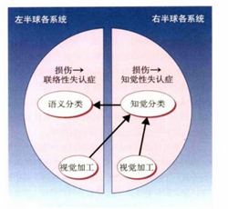
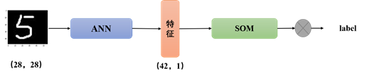
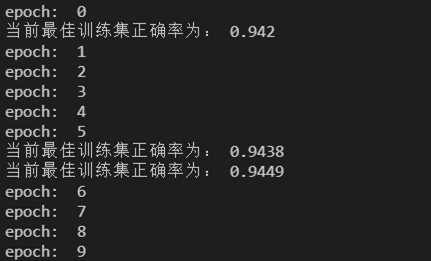
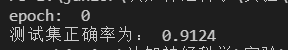

# 正向传播实验

秉着讨论的原则，这里大致说下我们组的实现思路之一，希望对后来者能够有所启发。

## 前提假设

我们组模拟的是Warrington物体识别两阶段模型，如下：

由于人类在进行物体识别时，首先经过两侧枕叶进行简单的特征提取，包括对各个方向的线段进行检测和神经兴奋。那么我们能否假设，人类具备的这种特征提取的功能是已经被编辑在基因之中的，也就是说，当一个从来没见过光明的失明患者，突然复明了，结果并不是需要从头开始训练特征感知器，而是只需要学习物体的种类。因此，在视觉加工阶段的特征提取器是神经网络模型训练得到的，而后面接的分类器是由大家很熟知的SOM网络。

## SOM生物学基础

神经生物学研究表明，不同的感觉输入（运动，视觉，听觉等）以有序的方式映射到大脑皮层的相应区域。

这种映射我们称之为拓扑映射，它具有两个重要特性：

1. 在表示或处理的每个阶段，每一条传入的信息都保存在适当的上下文（相邻节点）中。

2. 处理密切相关的信息的神经元之间保持密切，以便它们可以通过短突触连接进行交互。

我们的目标是建立人工的拓扑映射，以神经生物学激励的方式通过自组织进行学习。我们将遵循拓扑映射形成的原则：“拓扑映射中输出层神经元的空间位置对应于输入空间的特定域或特征”。

那么根据调研，自组织特征映射网（SOM）就是通过模拟人类神经元的拓扑映射进行模型学习。自组织的过程包括初始化、竞争、合作和适应这四个方面。

## 模型结构

由于SOM网络相当于聚类，所以最后的label判定可以首先对各特征进行命名，再用最近邻算法完成。

## 实验

### SOM网络分类结果

- 训练集

- 测试集

### pre-training vs. scratch

|     **方法**     | **结果** |
| :--------------: | :------: |
| **pre-training** |  0.9124  |
|   **scratch**    |  0.5092  |

